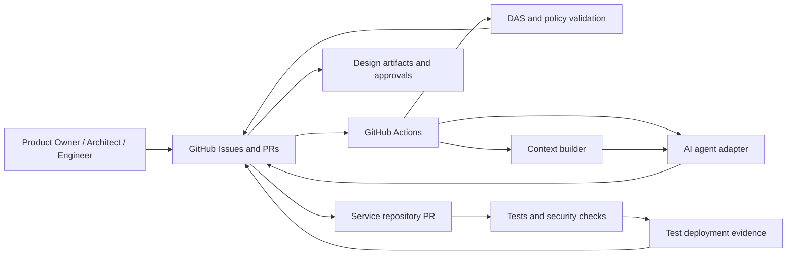

# Framework Architecture

## Components



## Responsibilities

| Component | Responsibility | Initial implementation |
|---|---|---|
| GitHub Issue | Business intake | Issue form |
| Design artifacts | Requirements, HLD, LLD, ADRs, approvals, traceability | Markdown + YAML in Git |
| Context builder | Assemble relevant, versioned source context | Initial deterministic file selection |
| AI adapter | Draft artifacts and bounded implementation changes | One replaceable adapter placeholder |
| DAS validator | Schema, links, hashes, required sections | GitHub Action entry point |
| Gate policy | Human approval and downstream unlock rules | YAML policy + required CI check |
| Human review | Business, architecture, engineering, release decisions | GitHub reviews and CODEOWNERS |
| Runtime evidence | Test/deployment/health evidence | CI artifacts initially |

## State transitions

```text
INTAKE
  → REQUIREMENTS_DRAFT
  → REQUIREMENTS_APPROVED
  → HLD_DRAFT
  → HLD_REVIEW
  → HLD_APPROVED
  → LLD_DRAFT
  → LLD_APPROVED
  → IMPLEMENTATION_PR
  → HUMAN_MERGE
  → DEPLOYMENT_EVIDENCE
```

Only these transitions require human decisions:

- `REQUIREMENTS_DRAFT → REQUIREMENTS_APPROVED`
- `HLD_REVIEW → HLD_APPROVED`
- `LLD_DRAFT → LLD_APPROVED`
- `IMPLEMENTATION_PR → HUMAN_MERGE`
- `DEPLOYMENT_EVIDENCE → RELEASE_APPROVED`

Automated checks may reject or pause a transition, but may not approve it.

## Design principle

The stable interface is the artifact and gate contract, not the model or agent. Any model provider can participate if it can consume a context pack and produce a valid DAS artifact.
