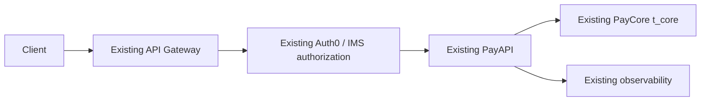
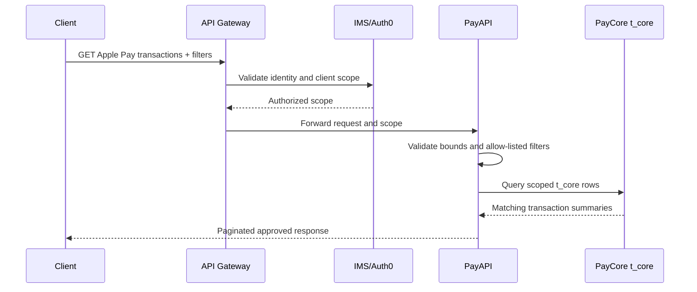
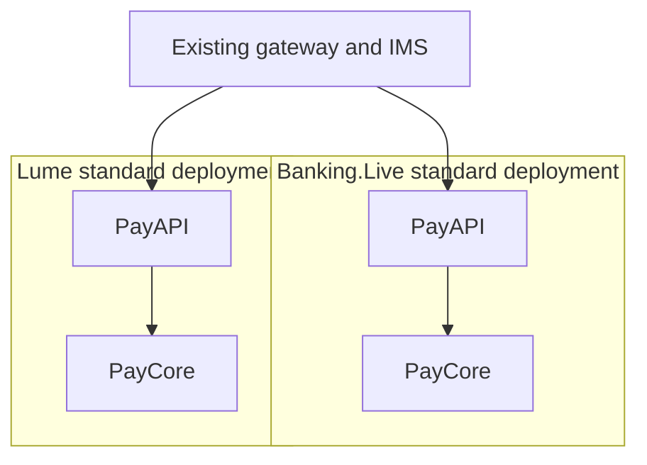
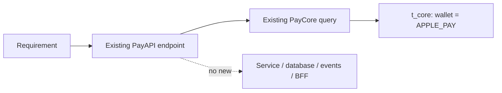

# HLD: Apple Pay transaction listing API

## 1. Impact assessment

| Dimension | Assessment | Evidence / gap |
|---|---|---|
| Change size | **Medium** | New read capability, filtering, pagination, and contract work in an existing API |
| Complexity / risk | **Moderate** | Client-facing transaction data, authorization scope, sensitive-token handling, and query performance |
| Services | **1 changed**: PayAPI | Existing PayCore is queried; no new service |
| Repositories | **1 expected**: PayAPI | Exact repository/package needs confirmation |
| Internal integrations | **3 reused**: API Gateway, IMS, PayCore | Existing patterns are required |
| External integrations | **0 new** | Client calls the existing PayAPI boundary |
| Data impact | **Read-only, medium sensitivity** | `t_core` columns and token representation need confirmation |
| Deployment impact | **Low** | Reuse existing BL and Lume PayAPI deployment paths |
| Migration impact | **None expected** | No schema migration, projection, or data movement proposed |
| Governance path | **Architecture review required** | Client-facing access to transaction data |

**Assessment summary:** This is a medium-sized, moderately complex extension of an existing service, not a new
platform capability. The main risks are API contract correctness, authorization
scope, sensitive-token handling, and query performance. The design should remain
inside PayAPI and PayCore unless verified context proves that an existing access
pattern must be reused differently.

## 2. Problem and outcome

Clients need to list transactions associated with Apple Pay using a card-token
reference and date range. The outcome is one governed, client-facing PayAPI
endpoint that reads the existing PayCore transaction source without exposing
PAN, SAD, raw Apple Pay payloads, or cross-client data.

## 3. Scope and boundaries

In scope:

- Add one authenticated read endpoint to the existing PayAPI.
- Query existing PayCore `t_core` data.
- Apply `wallet = APPLE_PAY`, approved card-token, client, region, and date filters.
- Reuse existing API, IMS authorization, rate-limit, observability, and release patterns.

Out of scope:

- New service, database, read model, event/CDC pipeline, tokenization flow, or BFF.
- New authentication or authorization mechanism.
- Changes to BL/Lume platform topology.
- Detailed implementation, SQL, class design, or migration scripts.

## 4. Confirmed context and context gaps

**Confirmed:** PayAPI is the client-facing boundary. PayCore `t_core` remains the
source. Apple Pay is represented by the `wallet` filter. BL and Lume are existing
deployment variants and their standard patterns are reused.

**Context gaps to close before LLD:**

1. PayAPI route, version, controller/package, and existing PayCore client location.
2. Verified `t_core` columns for token, date, client, region, and stable ordering.
3. Approved response fields and existing pagination/error conventions.
4. Existing index/query-plan evidence and safe capacity for the read workload.
5. Existing Auth0/IMS helper and the BL/Lume target classification matrix.

Each gap has an owner and retrieval action in the initiative-relative context. A
gap blocks LLD detail; it does not authorize an invented architecture.

## 5. Current-state and target approach

The target is a small extension of the existing request path:

The endpoint validates bounds before querying. PayAPI obtains client and region
scope from the authenticated context, adds the Apple Pay and approved filter
predicates, and returns only the existing approved transaction summary shape.
Exact field names and limits are context gates, not HLD inventions.

## 6. Options and trade-offs

| Option | Description | Decision view |
|---|---|---|
| A — existing access path | Extend the existing PayAPI repository/service to query `t_core`. | Preferred baseline; no new component. |
| B — existing PayCore read capacity | Use an already-deployed PayCore read pool/replica/access abstraction for the same query. | Consider only if the PayCore owner proves it already exists and is approved. |

Both options keep the same endpoint, authorization, source table, filters, and
response contract. Option B must not create a new projection, replica, event
pipeline, or service. The Solution Architect selects the option after the context
gaps and query-capacity evidence are reviewed.

## 7. Recommendation and decision points

Proceed with Option A as the baseline design direction. Use Option B only when an
existing PayCore access capability is confirmed. The human architecture gate must
confirm:

- the endpoint belongs in PayAPI;
- the approved `t_core` data and token semantics are correct;
- client and regional isolation are enforced by existing authorization;
- the existing query path can meet the agreed performance target; and
- BL/Lume deployment reuse is valid for the target estate.

## 8. Security, NFRs, and operations

- Reuse Gateway, Auth0, IMS, mTLS/workload identity, client isolation, rate limits,
  redaction, audit, correlation IDs, and existing dashboards.
- Never log or return PAN, SAD, raw/reversible tokens, or raw Apple Pay payloads.
- Reject invalid date ranges, page sizes, and cursors before PayCore access.
- Require bounded, stable pagination and an approved response allow-list.
- Confirm index coverage, query plans, timeout, SLO, retention, and alert values
  before LLD and release approval.

## 9. Delivery, rollout, and rollback

Implement only after architecture approval. Reuse the existing PayAPI release
process in BL and Lume. Roll out behind the existing route/feature-flag pattern,
validate with masked or synthetic data, monitor latency/errors/authorization
denials, and disable or revert through the existing release mechanism if needed.

## 10. Diagrams

### Request sequence

### Deployment view

### Scope boundary

An ERD and detailed C4 container diagram are deferred because the verified
`t_core` schema and actual PayAPI package structure are not yet in context.

## 11. Risks, ADRs, and open questions

Key risks are incorrect Apple Pay/token semantics, an unbounded or poorly indexed
query, authorization leakage, and deployment-standard mismatch. Mitigations and
owners are recorded in [risks.md](risks.md).

The proposed decisions are recorded in [adr.md](adr.md). Requirement coverage is
recorded in [traceability.md](traceability.md).

## 12. Architecture approval

Solution Architect / ARB: **PENDING — no approval recorded**
