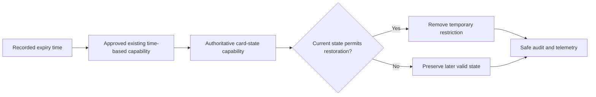

# HLD: Add API endpoint for temporary card blocking

## 1. Impact assessment

| Dimension | Assessment | Evidence or context gap |
|---|---|---|
| Change size | **Medium** | One additive API capability plus temporary state expiry; no new service is required by the approved requirement. |
| Complexity / risk | **High** | Card usability, restoration correctness, authorization, and confidential data are affected. |
| Services | 2 logical capabilities: card-management API and authoritative card-state capability | Names and ownership are not evidenced; CG-01 |
| Repositories | 0 identified | Repository discovery is not present; CG-01 |
| APIs and channels | Existing card-management API; portal and operations users | Route, version, gateway exposure, and client contract are not evidenced; CG-01, CG-02, CG-06 |
| Data, events, and jobs | Existing card-state persistence and an approved time-based expiry capability are required; no new store, event, or job is proposed | Persistence and expiry mechanism are unknown; CG-03, CG-04 |
| Integrations | 7 logical internal categories: API entry, authorization, card state, expiry, audit, observability, and documentation | Current interfaces and ownership are unknown; CG-01, CG-03, CG-05 |
| External integrations | None confirmed | Notifications or external gateway involvement require confirmation; CG-06 |
| Infrastructure and deployment | Reuse the existing runtime and release path | Environment, cloud, region, platform generation, and zone are unknown; CG-04 |
| Security and data impact | **High**; confidential card reference, requester, client/region, and audit metadata | Final CHD/Common Workload mapping and controls require confirmation; CG-04, CG-05 |
| Migration and compatibility | Low to medium; an additive contract is preferred, but state persistence compatibility is unknown | CG-01, CG-04 |
| Governance | Enhanced Solution Architect review; ARB applicability is a human decision | High-risk card-state change; CG-05 |

**Assessment summary:** This is a bounded extension of an existing card capability,
not a new platform. The medium profile is sufficient for the material API,
state-lifecycle, security, operations, rollout, and governance decisions. High
risk remains because the evidence does not identify the state owner or expiry
mechanism and the requirement affects card usability.

## 2. Problem and outcome

The approved requirement needs an authenticated API operation for an authorized
portal or operations user to block a card for a bounded duration and have it
restored automatically at expiry. Success is one valid temporary block with
requester and expiry metadata; invalid, unauthorized, or already-blocked
requests do not change state; expiry is auditable and observable without
exposing PAN, SAD, secrets, authentication headers, or unnecessary customer data.

## 3. Scope and boundaries

**In scope**

- Add a backward-compatible mutation to the existing card-management API.
- Validate duration, authorization, client/region scope, and active-block state
  using existing contracts and policy.
- Apply the temporary restriction at the authoritative card-state boundary.
- Record the required requester, request, creation, expiry, correlation, and
  audit metadata using existing data and audit standards.
- Restore automatically through the approved existing time-based capability,
  subject to current state precedence.
- Reuse existing API, identity, audit, observability, deployment, and rollback
  patterns.

**Out of scope**

- A new card-control service, authorization model, infrastructure, deployment
  environment, notification platform, event platform, or webhook integration.
- Permanent cancellation, replacement, token lifecycle, or a redesign of card
  state.
- Detailed routes, schemas, tables, classes, retry algorithms, tests, migration
  scripts, and runbooks; these belong in the LLD or linked supporting documents.

## 4. Context basis and gap register

### Confirmed facts

- `REQ-KAN-5` is approved and requires reuse of existing card-management,
  authorization, audit, observability, and deployment patterns.
- The context pack is assembled as `CTX-KAN-5-v1`; initiative-relative context is
  `unreleased` and has no selected version.
- API standards require HTTPS, authenticated and authorized requests, trusted
  tenant context, compatible versioning, `X-Request-Id`, and
  `X-Idempotency-Key` for safe mutating retries.
- The identity direction separates Auth0 identity, API Gateway/API Hub JWT
  validation, IMS authorization, and service-boundary enforcement.
- Architecture, isolation, secure-logging, observability, and event standards
  require explicit ownership, boundaries, failure behavior, safe telemetry,
  and rollback.

### Context baseline

| Package | Selected version | Source commit |
|---|---|---|
| Architecture | `context/architecture/v1.0.0` | `8f6a59238f155cef7395256ba90ab7f87cb51d78` |
| Domain | `context/domain/v1.0.0` | `8f6a59238f155cef7395256ba90ab7f87cb51d78` |
| Platform | `context/platform/v1.0.0` | `8f6a59238f155cef7395256ba90ab7f87cb51d78` |
| Product | `context/product/v1.0.0` | `8f6a59238f155cef7395256ba90ab7f87cb51d78` |
| Security | `context/security/v1.0.0` | `8f6a59238f155cef7395256ba90ab7f87cb51d78` |
| Technology | `context/technology/v1.0.0` | `8f6a59238f155cef7395256ba90ab7f87cb51d78` |
| Initiative-relative context | `unreleased` | Not available |

### Canonical context gaps

| ID | Missing fact | Owner | Retrieval action and decision impact |
|---|---|---|---|
| CG-01 | Card-management and card-state service owners, repositories, API route/version, and authoritative state model | Card service/API owner | Provide catalog, repository, API, and state-machine evidence before selecting the extension boundary. |
| CG-02 | Approved duration bounds, requester roles/scopes, client/region resolution, and duplicate-request policy | Product, Risk, Card, and Identity owners | Confirm policy and authorization evidence before finalizing the contract and errors. |
| CG-03 | Approved expiry mechanism, retry/failure handling, idempotency, and restoration behavior | Card platform and SRE owners | Provide the existing time-based pattern and recovery evidence before LLD. |
| CG-04 | Persistence model, CHD/Common Workload zone, client-isolation boundary, migration compatibility, and deployment environment | Card data, Security, and Platform owners | Provide data, schema ownership, environment, and migration evidence before implementation design. |
| CG-05 | Audit schema, telemetry/redaction, dashboards, alerts, SLOs, retention, and support ownership | Operations/SRE, Security, and API owners | Confirm operational standards and acceptance evidence before release. |
| CG-06 | Whether notifications, external gateway exposure, or another external integration is required | Product and Card owners | Confirm integration inventory; no external integration is included without evidence. |

These gaps are the explicit resolution of the revision feedback: unverified
implementation details are no longer presented as assumptions or decisions.

## 5. Current state and target approach

The requirement confirms that no governed time-bounded card-blocking API exists.
It does not identify the owning service, repository, route, state store, expiry
mechanism, or deployment estate (CG-01, CG-03, CG-04).

The proposed logical flow is:

1. A portal or operations client uses the existing card-management API entry
   path.
2. The approved identity path authenticates the principal and resolves
   permission and client/region context; the card boundary enforces it.
3. The authoritative state capability validates duration, repeat-safe mutation,
   eligibility, and absence of an active temporary block.
4. One state operation records the temporary restriction and required metadata.
5. The approved time-based capability requests expiry at the recorded time.
6. Restoration occurs only when current state rules permit it; otherwise the
   later valid state is preserved.
7. Existing API, audit, and observability contracts report the outcome.

No direct portal-to-state connection, new persistence, event, worker, webhook,
notification system, or external integration is proposed.

```mermaid
sequenceDiagram
    participant Actor as "Portal or operations actor"
    participant Entry as "Existing API entry path"
    participant Auth as "Existing identity and authorization"
    participant API as "Existing card-management API"
    participant State as "Authoritative card-state capability"
    participant Ops as "Existing audit and observability"
    Actor->>Entry: "Temporary-block request"
    Entry->>Auth: "Authenticate and resolve access context"
    Auth-->>Entry: "Allow or deny"
    Entry->>API: "Authorized request with correlation context"
    API->>State: "Validate and apply temporary block"
    State-->>Ops: "Safe audit and telemetry"
    State-->>API: "Outcome"
    API-->>Actor: "Existing success or error contract"
```



## 6. Reuse and platform fit

| Capability category | Decision | Evidence and owner/onboarding |
|---|---|---|
| API exposure | Extend the existing card-management API; do not add an API service | API standards and enterprise reuse; API owner to identify the route (CG-01) |
| Identity and authorization | Reuse Auth0, API Gateway/API Hub, IMS, and existing service enforcement | Identity context; Identity and Card owners to confirm roles and region (CG-02) |
| Card state and expiry | Extend the authoritative state owner and reuse its approved expiry capability | Requirement and reuse guardrail; Card platform owner to provide evidence (CG-01, CG-03) |
| Persistence and isolation | Reuse the existing store and approved client/zone boundary | Isolation and CHD guidance; Card data/Security/Platform owners (CG-04) |
| Audit and observability | Reuse shared standards and existing assets; no local monitoring stack | Secure logging and observability context; Operations/Security owners (CG-05) |
| Events, webhooks, and notifications | No new integration; use an existing governed capability only if CG-03 or CG-06 proves it is required | Event/reuse guardrails; Product and Card owners |
| Repositories and deployment | Reuse the owning repository and release path once identified | No repository is evidenced; service/platform owners (CG-01, CG-04) |

The search found standards and platform patterns, but not the implementation
catalog or runtime evidence. “Not found” is therefore a gap, not proof that a
capability is absent.

## 7. Options and recommendation

| Option | Trade-off | Decision |
|---|---|---|
| Extend the authoritative card capability and reuse its expiry path | Smallest surface and one state owner; depends on CG-01 and CG-03 | **Recommended** |
| Extend the state capability and use the governed event platform if no suitable expiry path exists | Adds schema, ownership, ordering, retry/DLQ, access, and operations work | Conditional fallback after CG-03 |
| Create a standalone temporary card-control service | Duplicates state and authorization ownership and violates the reuse constraint | Rejected |

The recommended design is the smallest compliant design: one additive operation
at the existing card boundary, with existing identity, state, expiry, audit,
observability, deployment, and rollback capabilities. It does not choose a
route, schema, persistence structure, cloud, or timing implementation before
the corresponding gaps are resolved.

## 8. Security, NFRs, and operations

- Use HTTPS and the approved identity chain; validate authorization and
  client/region context at the service boundary (CG-02, CG-04).
- Keep card references, requester identity, state metadata, and audit metadata
  confidential. Do not log PAN, SAD, secrets, tokens, authentication headers,
  or full sensitive payloads. Use safe correlation and outcome identifiers.
- Confirm CHD/Common Workload placement, storage, backup, cache, event, network,
  and telemetry boundaries before LLD (CG-04).
- Make creation and expiry repeat-safe using the existing state and idempotency
  conventions. Define failure, retry, reconciliation, and restoration
  precedence from the approved mechanism (CG-03).
- Reuse structured logs, metrics, and traces for authorized creation, denial,
  validation failure, duplicate request, expiry, restoration, and dependency
  failure. Confirm dashboards, alerts, SLOs, retention, access, and runbook
  ownership before release (CG-05).
- No availability, latency, throughput, retention, or recovery target is
  invented here; the owning standards and service evidence must supply them.

## 9. Delivery, rollout, and rollback

1. Resolve CG-01 through CG-06, confirm security and operational evidence, and
   obtain Solution Architect/ARB direction before LLD.
2. Define the compatible API contract and state transition in the LLD, then use
   the owning repository's existing pipeline and environment progression.
3. Release the additive operation through the existing access or configuration
   control; do not introduce a feature-flag platform.
4. Verify authorized creation, denial, invalid and duplicate requests, expiry,
   preservation of later state, auditability, safe telemetry, and recovery
   using approved non-sensitive test data.
5. If correctness or health signals fail, stop new admission using an existing
   control and revert the compatible change. Do not bulk-remove active blocks
   without Card, Risk, and Operations authorization.

No data migration is assumed. If CG-04 identifies persistence changes, the LLD
must define compatible migration, coexistence, rollback, and reconciliation.

## 10. Risks and decision points

| ID | Risk | Impact | Mitigation / decision | Owner |
|---|---|---|---|---|
| R-01 | Expiry restores a card despite a later valid restriction | Unsafe card usability | Enforce restoration precedence at the authoritative state boundary; resolve CG-03 and CG-04 | Card platform |
| R-02 | Expiry is delayed, duplicated, or unavailable | Card remains blocked or restoration is inconsistent | Reuse a proven mechanism and its recovery controls; resolve CG-03 and CG-05 | Card platform and SRE |
| R-03 | Authorization or client/region context is incomplete | Cross-client or cross-region control | Confirm end-to-end policy enforcement and isolation evidence; resolve CG-02 and CG-04 | Identity, Card, Security |
| R-04 | Audit or telemetry exposes restricted data | Security or compliance exposure | Apply minimization, redaction, access control, and Security review; resolve CG-04 and CG-05 | Security and Operations |
| R-05 | Estate or contract compatibility is unknown | Inconsistent client behavior or unsafe rollout | Identify target estate, common contract, coexistence, and rollback evidence; resolve CG-01 and CG-04 | Architecture and Card |
| R-06 | Duration, actor, duplicate, or notification policy is incomplete | Incorrect business behavior | Obtain Product, Risk, Card, and Identity decisions; resolve CG-02 and CG-06 | Product and Card |

## 11. Traceability

| Item | Link / status |
|---|---|
| Source work item | [Jira KAN-5](https://randomtry.atlassian.net/browse/KAN-5) |
| Approved requirement | [`../requirement.md`](../requirement.md), `REQ-KAN-5-01` through `REQ-KAN-5-08` |
| Context manifest | [`../context-manifest.yaml`](../context-manifest.yaml), `CTX-KAN-5-v1` |
| Design baseline | [`../evidence/design-baseline.yaml`](../evidence/design-baseline.yaml) |
| HLD assessment | [`../evidence/hld-assessment.yaml`](../evidence/hld-assessment.yaml) |
| Affected services and repositories | Two logical capabilities; repositories and owners remain CG-01 |
| Follow-on LLD | Locked until human architecture approval |

## Architecture approval

Solution Architect / ARB: pending. This HLD is a draft proposal and does not
approve architecture, implementation, release, or deployment.
