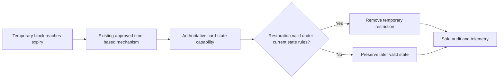

# HLD: Add API endpoint for temporary card blocking

## 1. Impact assessment

| Dimension | Assessment | Evidence or context gap |
|---|---|---|
| Change size | **Medium** | One API mutation and a time-bounded card-state lifecycle extension; no new service or platform is proposed. |
| Complexity / risk | **High** | Incorrect blocking or restoration affects card usability, authorization boundaries, and confidential data handling. |
| Services or repositories | 2 logical capabilities; repositories and service names unconfirmed | Existing card-management API and authoritative card-state capability; CG-01 |
| APIs and channels | Existing client-facing card-management API; portal and operations channels | Exact route, audience, BFF path, and compatibility contract; CG-02 |
| Data stores and events/jobs | Existing authoritative card-state persistence and existing expiry mechanism | State store, zone, isolation, and expiry implementation; CG-03, CG-05 |
| Integrations | 7 logical internal points: gateway, authorization, card state, audit, observability, documentation, and expiry processing | Current interfaces and any external involvement; CG-01, CG-02, CG-03, CG-06 |
| External integrations | None confirmed | Notifications, webhooks, schemes, and token services are not proposed; CG-06 |
| Infrastructure and deployment | Existing runtime, gateway, persistence, and release path | Cloud, region, platform generation, and shared/dedicated boundaries; CG-05 |
| Security and data impact | High; confidential card references, requester identity, client/region context, and audit metadata | CHD/Common Workload classification and controls; CG-05, CG-06 |
| Migration and compatibility | Low to medium; additive API expected, state persistence impact unknown | Legacy/strategic estate coexistence and schema compatibility; CG-01, CG-05 |
| Governance path | Enhanced Solution Architect review with Security input; ARB applicability to be confirmed | High-risk card-state change; CG-05, CG-06 |

**Assessment summary:** This is a bounded extension of an existing capability rather
than a new card-control platform. It is high risk because the expiry path can
incorrectly restrict or restore card use. The medium profile is proportionate:
the design covers material alternatives, security, operations, rollout, and
rollback while deferring implementation detail to the LLD.

## 2. Problem and outcome

Authorized portal and operations users need to suspend a card for a bounded
period when suspicious activity is detected, then have the restriction removed
automatically. The intended outcome is a repeat-safe, authenticated mutation
through the existing card-management API that records the minimum lifecycle
metadata and restores only the prior usable state when no later valid state
prevents restoration.

Success means that valid requests create one temporary block, invalid,
unauthorized, and duplicate requests do not change card state, and expiry
produces an auditable and observable restoration decision without exposing
PAN, SAD, secrets, or unnecessary customer data.

## 3. Scope and boundaries

**In scope**

- Add a backward-compatible mutation to the existing card-management API.
- Reuse the established authentication, authorization, client, and regional
  boundary.
- Extend the authoritative card-state capability with temporary-block metadata
  or its equivalent.
- Reuse the approved time-based mechanism for automatic expiry.
- Preserve existing audit, observability, documentation, deployment, and
  rollback patterns.

**Out of scope**

- A standalone card-control service, new authorization model, infrastructure,
  deployment environment, or notification platform.
- Permanent cancellation, replacement, token lifecycle, or card-state redesign.
- New scheme, webhook, event-stream, or external notification integration.
- Detailed routes, schemas, database structures, retry algorithms, tests,
  migration scripts, runbooks, or implementation classes; these belong in the
  LLD and linked supporting documents.

## 4. Context basis and gap register

### Confirmed facts

- `REQ-KAN-5` is approved and requires reuse of existing card-management,
  authorization, audit, observability, and deployment patterns.
- API standards require HTTPS, authenticated and authorized requests, trusted
  tenant context, versioned compatible contracts, `X-Request-Id`, and
  `X-Idempotency-Key` for mutating requests where safe retries are required.
- The shared identity direction is Auth0 for identity, API Gateway/API Hub for
  JWT validation, IMS for permissions and client/region context, and service
  boundaries for final enforcement.
- Enterprise principles require explicit ownership, failure behavior,
  observability, security, and rollback.
- Client isolation and CHD/Common Workload guidance require explicit
  application, data, network, event, backup, and telemetry boundaries.
- Secure logging prohibits PAN, SAD, secrets, authentication headers, tokens,
  and full sensitive payloads in logs or telemetry.
- The exact design baseline is
  [`../evidence/design-baseline.yaml`](../evidence/design-baseline.yaml).

### Context baseline

| Package | Selected version | Source commit |
|---|---|---|
| Architecture | `context/architecture/v1.0.0` | `8f6a59238f155cef7395256ba90ab7f87cb51d78` |
| Domain | `context/domain/v1.0.0` | `8f6a59238f155cef7395256ba90ab7f87cb51d78` |
| Platform | `context/platform/v1.0.0` | `8f6a59238f155cef7395256ba90ab7f87cb51d78` |
| Product | `context/product/v1.0.0` | `8f6a59238f155cef7395256ba90ab7f87cb51d78` |
| Security | `context/security/v1.0.0` | `8f6a59238f155cef7395256ba90ab7f87cb51d78` |
| Technology | `context/technology/v1.0.0` | `8f6a59238f155cef7395256ba90ab7f87cb51d78` |
| Initiative-relative context | `unreleased` | Not available |

### Canonical context gaps

| ID | Missing fact | Owner | Retrieval action and decision impact |
|---|---|---|---|
| CG-01 | Owning card-management and card-state services, repositories, API route/version, and authoritative state model | Card service/API owner | Provide service-catalog, repository, API, and state-machine evidence before selecting the extension boundary. |
| CG-02 | Approved duration bounds, requester roles/scopes, client/region resolution, and duplicate-request behavior | Product, Risk, Card, and Identity owners | Confirm policy and authorization evidence before contract and error decisions. |
| CG-03 | Approved expiry mechanism, retry/failure handling, idempotency, and restoration behavior | Card platform and SRE owners | Provide the existing scheduler/event pattern and operational recovery evidence before LLD. |
| CG-04 | Persistence model, CHD/Common Workload zone, client-isolation boundary, migration/compatibility impact, and deployment environment | Card data, Security, and Platform owners | Provide data classification, schema ownership, environment, and migration evidence. |
| CG-05 | Required audit schema, telemetry/redaction, dashboards, alerts, SLOs, retention, and support ownership | Operations/SRE, Security, and API owners | Confirm existing operational standards and assets before release acceptance. |
| CG-06 | Whether notifications, external gateway exposure, or other external integration is required | Product and Card owners | Confirm the integration inventory; no such integration is included without evidence. |

## 5. Current-state and target approach

The current state confirmed by the requirement is that no governed,
time-bounded card-blocking API exists. The owning implementation and runtime
estate remain unconfirmed (CG-01).

The target logical flow is:

1. An existing portal or operations client invokes the existing
   card-management API through its approved entry path.
2. The entry path authenticates the request; the existing BFF and service
   boundaries enforce permission and client/region policy.
3. The authoritative card-state capability validates duration, idempotency,
   eligibility, and absence of an active temporary block.
4. One authoritative state operation applies the temporary restriction and
   records requester, creation, expiry, correlation, and restoration metadata.
5. The existing time-based mechanism requests restoration through the same
   state boundary. Restoration is conditional and must not override a later
   valid non-usable state.
6. The existing API contract returns standard success or safe error semantics.

The exact state, persistence, timing, and deployment choices are subject to
CG-01 through CG-05. No new database, topic, worker, webhook, notification
service, or direct portal-to-domain connection is proposed.

```mermaid
sequenceDiagram
    participant Actor as "Authorized portal or operations actor"
    participant Gateway as "Existing API Gateway or API Hub"
    participant Authz as "Existing authorization path"
    participant CardAPI as "Existing card-management API"
    participant State as "Authoritative card-state capability"
    participant Audit as "Existing audit and observability platforms"
    Actor->>Gateway: "Temporary-block request"
    Gateway->>Gateway: "Authenticate and validate request context"
    Gateway->>Authz: "Resolve permission and client/region context"
    Authz-->>Gateway: "Allow or deny"
    Gateway->>CardAPI: "Authorized request with correlation context"
    CardAPI->>State: "Validate and apply temporary block"
    State-->>Audit: "Safe audit and telemetry signals"
    State-->>CardAPI: "Outcome"
    CardAPI-->>Actor: "Standard success or safe error"
```



## 6. Options and trade-offs

| Option | Benefits | Material trade-offs | Decision |
|---|---|---|---|
| A. Extend the existing card-management and card-state capability and reuse its approved expiry mechanism | One state owner, smallest interface and operational surface, aligned with the requirement | Feasibility depends on CG-01 and CG-03; restoration precedence requires CG-04 | Preferred |
| B. Extend the state capability and use the enterprise event/scheduling platform only if no supported expiry path exists | Durable asynchronous processing and independent recovery | Adds event ownership, schema, ordering, retry, DLQ, access, and operational obligations | Conditional fallback after CG-03 |
| C. Create a standalone temporary card-control service | Isolates feature logic | Duplicates state ownership and authorization and violates the no-new-service constraint | Rejected |

## 7. Recommendation and decision points

**Applicable standards and approved patterns:**

| Standard / pattern | How it applies | Evidence |
|---|---|---|
| API standards | Additive HTTPS contract, JWT authentication, trusted tenant context, idempotent mutation, shared errors, documentation | `context/architecture/v1.0.0` |
| Auth0, API Gateway/API Hub, and IMS | Reuse identity, edge validation, permission, and client/region authorization boundaries | `context/architecture/v1.0.0` |
| Enterprise capabilities and reuse | Extend existing state and reuse shared audit, observability, and timing capabilities before building | `context/platform/v1.0.0` |
| Client isolation and CHD/Common Workload controls | Prove data, access, storage, backup, event, and telemetry boundaries before implementation | `context/platform/v1.0.0`, `context/security/v1.0.0` |
| Observability and secure logging | Use approved structured telemetry and safe identifiers; exclude sensitive data | `context/platform/v1.0.0`, `context/security/v1.0.0` |
| Banking.Live/Lume deployment direction | Distinguish legacy and strategic estates and reuse the target deployment path | `context/product/v1.0.0`, `context/platform/v1.0.0` |

**Recommended option:** Choose Option A: add the API operation and
time-bounded state behavior at the existing authoritative card-management
boundary, reusing the estate's existing expiry, authorization, audit,
observability, and deployment capabilities. This is the smallest compliant
design; Option B is allowed only if the owners resolve CG-03 with evidence that
the current mechanism cannot meet the required reliability.

The Solution Architect or ARB must decide whether the high-risk change requires
ARB review in addition to the required architecture approval, and must confirm
CG-01 through CG-05 before LLD generation.

## 8. Security, NFRs, and operations

### Security and privacy

- Use HTTPS and the existing Auth0/API Gateway/API Hub/IMS path where it is the
  target estate pattern; enforce authorization again at the service boundary.
- Propagate and validate client and regional context without revealing card
  existence or state to unauthorized callers.
- Classify the API, state persistence, expiry path, backups, caches, audit data,
  and telemetry as CHD, Common Workload, or another approved zone before LLD
  (CG-04).
- Log only safe identifiers, correlation IDs, outcome codes, and masked or
  tokenized values when operationally necessary. Never log PAN, SAD, secrets,
  tokens, headers, or full request/response bodies.
- Reuse approved encryption, key/certificate, retention, access, and
  cross-zone controls (CG-04, CG-05).

### Reliability and operations

- Make creation and expiry repeat-safe using the established idempotency and
  state-ownership conventions.
- Instrument authorized creation, denial, validation failure, duplicate
  request, expiry due/completed/failed, restoration prevented by later state,
  processing lag, dependency failure, and latency with safe tenant and region
  tags (CG-05).
- Propagate the approved request and correlation identifiers across synchronous
  and expiry paths, using the existing structured logs, metrics, and tracing.
- Assign dashboard, alert, SLO, retention, access, and runbook ownership before
  release (CG-05).
- Use the existing reconciliation and recovery process for missed or failed
  expiry; do not invent thresholds or retention values in this HLD (CG-03,
  CG-05).

## 9. Delivery, rollout, and rollback

1. Resolve CG-01 through CG-05, confirm the current API/state contract,
   security classification, expiry support, operational ownership, and obtain
   Solution Architect approval before LLD.
2. Add the operation as a backward-compatible API change, then publish its
   approved contract and client guidance through the existing documentation
   process.
3. Use the existing service pipeline and environment progression. Enable the
   capability only through an existing approved release, entitlement, or
   configuration control; no new feature-flag platform is proposed.
4. Verify authorized creation, denied/invalid/duplicate behavior, expiry
   restoration, later-state preservation, auditability, telemetry, and expiry
   recovery in approved environments using non-sensitive data.
5. If health or correctness signals fail, stop new request admission through
   the existing control and revert the compatible service change. Do not
   bulk-remove active blocks without Card, Risk, and Operations authorization.

No data migration is assumed. If CG-04 identifies required state persistence
changes, the LLD must define compatible migration, backfill, rollback, and
coexistence behavior.

## 10. Diagrams

The request and expiry flows above are the only diagrams needed for this
medium-profile decision. The security and deployment boundaries remain
conditional on CG-04.

## 11. Risks and decision points

| Risk | Impact | Mitigation / decision required | Owner |
|---|---|---|---|
| Restoration overrides a later restriction or state change | Card may become usable when it should not be | Enforce state precedence and conditional restoration at the authoritative state boundary; resolve CG-04 | Card platform owner |
| Expiry processing is delayed, duplicated, or unavailable | Cards remain blocked too long or restoration is inconsistent | Reuse a proven mechanism and define idempotency, reconciliation, alerting, and recovery; resolve CG-03 and CG-05 | Card platform and SRE |
| Authorization or client/region propagation is incomplete | Cross-client or cross-region card control | Validate permissions end to end and obtain Security review; resolve CG-02 and CG-04 | Identity, Card, and Security |
| Audit or telemetry exposes restricted data | Security or compliance exposure | Apply data minimization, redaction, access controls, and Security review; resolve CG-05 | Security and SRE |
| Legacy and strategic estates expose incompatible behavior | Inconsistent client behavior or unsafe rollout | Confirm affected generation, common contract, coexistence, and retirement signal; resolve CG-01 and CG-04 | Card platform and Architecture |
| Business policy is incomplete | Incorrect duration, actor, duplicate, or notification behavior | Obtain Product, Risk, Card, and Identity decisions; resolve CG-02 and CG-06 | Product and Card owners |

## 12. Traceability

| Item | Link / status |
|---|---|
| Source work item | [Jira KAN-5](https://randomtry.atlassian.net/browse/KAN-5) |
| Approved requirement | [`../requirement.md`](../requirement.md), `REQ-KAN-5-01` through `REQ-KAN-5-08` |
| Context manifest | [`../context-manifest.yaml`](../context-manifest.yaml), `CTX-KAN-5-v1` |
| Context baseline | [`../evidence/design-baseline.yaml`](../evidence/design-baseline.yaml) |
| Impact assessment | [`../evidence/hld-assessment.yaml`](../evidence/hld-assessment.yaml) |
| Affected services and repositories | Not identified; CG-01 |
| Follow-on LLD | Locked until human architecture approval |

## Architecture approval

Solution Architect / ARB: pending. This HLD is a draft proposal and does not
approve architecture, implementation, release, or deployment.
