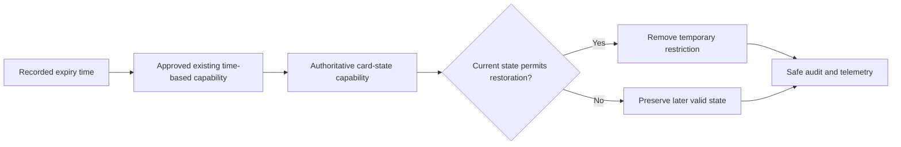

# HLD: Add API endpoint for temporary card blocking

## 1. Change assessment

| Dimension | Assessment | Evidence or context gap |
|---|---|---|
| Change size | **Medium** | Additive API capability and timed state restoration; no new platform is requested. |
| Complexity / risk | **High** | Card usability, state precedence, authorization, and confidential data are affected. |
| Services or repositories | 2 logical capabilities: card-management API and authoritative card-state capability; repositories not identified | CG-01 |
| APIs and channels | Existing card-management API for portal and operations users | Route, version, gateway exposure, and contract are unknown; CG-01, CG-02, CG-06 |
| Internal integrations | Identity and authorization, card state, expiry, audit, observability, and documentation | Existing interfaces and owners are unknown; CG-01, CG-03, CG-05 |
| External integrations | None confirmed | Notifications or external gateway involvement is unknown; CG-06 |
| Data, events, and jobs | Existing card-state persistence and an approved time-based expiry capability; no new store or event proposed | Persistence, event/job pattern, and CHD boundary are unknown; CG-03, CG-04 |
| Infrastructure and deployment | Existing runtime, regional estate, and release path | Platform generation, cloud, region, workload zone, and environment are unknown; CG-04 |
| Migration or compatibility | Low to medium; additive API preferred | State persistence and BL2/Lume compatibility are unknown; CG-01, CG-04 |
| Governance | Enhanced Solution Architect review; ARB applicability requires human decision | High-risk card-state change; CG-05 |

**Assessment summary:** The change is bounded to an existing card capability, but
automatic restoration and authorization failure modes make the risk high. The
medium profile is appropriate because the decision needs API, state-lifecycle,
security, operations, rollout, and compatibility views without evidence for a
new service or infrastructure.

## 2. Motivation and outcome

Authorized portal and operations users need to suspend a card for a bounded
period during suspected fraud or approved support activity, then have the card
automatically restored without manual unblocking being the only path. A valid
request must create one temporary block with requester and expiry metadata;
invalid, unauthorized, or already-blocked requests must not change card state.

## 3. Authors and approvals

| Role | Person or team | Status |
|---|---|---|
| Business owner | `team.cards` | Requirement approved |
| Solution Architect / ARB | To be assigned | Pending |
| Card service / API owner | To be confirmed | Pending; CG-01 |
| Security and identity | Security / Identity owners | Pending; CG-02, CG-04, CG-05 |
| Operations / SRE | Operations / SRE owners | Pending; CG-03, CG-05 |

## 4. Solution overview

Extend the existing card-management API with an authenticated, repeat-safe
temporary-block mutation. The existing identity path authenticates the caller
and resolves client/region permissions; the authoritative card-state capability
validates the duration and current state, records expiry metadata, and uses its
approved time-based capability to restore the prior usable state when current
state precedence permits. Existing audit, telemetry, deployment, and rollback
patterns are reused. Exact interfaces remain subject to CG-01 through CG-06.

## 5. Context baseline

The approved requirement is `REQ-KAN-5`. The assembled manifest is
`CTX-KAN-5-v1`; no initiative-relative context is selected and its version is
`unreleased`.

| Package | Selected version | Source commit |
|---|---|---|
| Architecture | `context/architecture/v1.0.0` | `8f6a59238f155cef7395256ba90ab7f87cb51d78` |
| Domain | `context/domain/v1.0.0` | `8f6a59238f155cef7395256ba90ab7f87cb51d78` |
| Platform | `context/platform/v1.0.0` | `8f6a59238f155cef7395256ba90ab7f87cb51d78` |
| Product | `context/product/v1.0.0` | `8f6a59238f155cef7395256ba90ab7f87cb51d78` |
| Security | `context/security/v1.0.0` | `8f6a59238f155cef7395256ba90ab7f87cb51d78` |
| Technology | `context/technology/v1.0.0` | `8f6a59238f155cef7395256ba90ab7f87cb51d78` |
| Initiative-relative context | `unreleased` | Not available |

Confirmed context requires clear ownership, backward-compatible APIs, explicit
failure and rollback behavior, Auth0/API Gateway/IMS separation, client and
regional isolation, safe logging, shared observability, and reuse before build.
The service estate, repository inventory, and runtime facts are not confirmed.

## 6. Context gaps

| Gap ID | Missing fact | Owner | Retrieval action | Blocks decision? |
|---|---|---|---|---|
| CG-01 | Card-management and card-state owners, repositories, API route/version, and authoritative state model | Card service/API owner | Provide service catalog, repository, API, and state-machine evidence | Yes |
| CG-02 | Approved duration bounds, requester roles/scopes, client/region resolution, and duplicate-request policy | Product, Risk, Card, and Identity owners | Confirm policy and authorization evidence | Yes |
| CG-03 | Approved expiry mechanism, retry/failure handling, idempotency, and restoration behavior | Card platform and SRE owners | Provide existing time-based pattern and recovery evidence | Yes |
| CG-04 | Persistence model, CHD/Common Workload zone, isolation boundary, estate, and migration compatibility | Card data, Security, and Platform owners | Provide schema ownership, environment, zone, and migration evidence | Yes |
| CG-05 | Audit schema, telemetry/redaction, dashboards, alerts, SLOs, retention, and support ownership | Operations/SRE, Security, and API owners | Confirm operational standards and acceptance evidence | Before release |
| CG-06 | Whether notifications, external gateway exposure, or another external integration is required | Product and Card owners | Confirm integration inventory; do not add an integration without evidence | Before contract finalization |

## 7. Risks

| Risk ID | Risk | Impact | Mitigation or owner |
|---|---|---|---|
| RISK-001 | Expiry restores a card despite a later valid restriction | Unsafe card usability or fraud exposure | Apply restoration precedence at the authoritative state boundary; resolve CG-03 and CG-04. Owner: Card platform |
| RISK-002 | Expiry is delayed, duplicated, or unavailable | Card remains blocked or restoration becomes inconsistent | Reuse a proven mechanism with retry, reconciliation, and recovery controls; resolve CG-03 and CG-05. Owner: Card platform and SRE |
| RISK-003 | Authorization or client/region context is incomplete | Cross-client or cross-region control | Enforce policy in the gateway/BFF and service boundary; resolve CG-02 and CG-04. Owner: Identity, Card, and Security |
| RISK-004 | Audit or telemetry exposes restricted data | Security or compliance exposure | Minimize and redact fields, control access, and require Security review; resolve CG-04 and CG-05. Owner: Security and Operations |
| RISK-005 | Estate or contract compatibility is unknown | Inconsistent behavior across clients or generations | Confirm target estate, common contract, coexistence, and rollback evidence; resolve CG-01 and CG-04. Owner: Architecture and Card |
| RISK-006 | Duration, actor, duplicate, or notification policy is incomplete | Incorrect business behavior or customer impact | Obtain Product, Risk, Card, and Identity decisions; resolve CG-02 and CG-06. Owner: Product and Card |

## 8. Solution design

### 8.1 Scope and boundaries

In scope are an additive operation in the existing card-management API, duration
and authorization validation, temporary state metadata, automatic expiry,
auditable outcomes, safe telemetry, and reuse of the existing deployment path.
Permanent cancellation, replacement, authentication redesign, a new card-control
service, new infrastructure, and notification delivery are out of scope unless
CG-06 identifies an approved existing pattern.

The logical impact is two existing capabilities: the API boundary and the
authoritative card-state boundary. No new database, event topic, worker,
webhook, notification system, or external integration is selected by this HLD.

### 8.2 Logical and security view

The portal or operations channel uses the approved API entry path. Auth0
identifies the principal, API Gateway/API Hub validates the JWT, IMS resolves
permission and client/region context, and the service enforces authorization
again at its own boundary. A portal must not connect directly to card state.

```mermaid
sequenceDiagram
    participant Actor as "Portal or operations actor"
    participant Gateway as "Existing API Gateway or API Hub"
    participant Auth as "Auth0 and IMS"
    participant Api as "Existing card-management API"
    participant State as "Authoritative card-state capability"
    participant Telemetry as "Existing audit and observability"
    Actor->>Gateway: "Temporary-block request"
    Gateway->>Auth: "Validate identity and resolve access context"
    Auth-->>Gateway: "Allow or deny"
    Gateway->>Api: "Forward authorized request and correlation context"
    Api->>State: "Validate and apply temporary block"
    State-->>Telemetry: "Record safe outcome and audit metadata"
    State-->>Api: "Success or domain error"
    Api-->>Actor: "Existing success or error contract"
```

### 8.3 Information and data view

The state owner remains authoritative. The minimum recorded information is the
card reference or token, requester identity reference, request and creation
timestamps, expiry timestamp, and correlation/audit identifiers, subject to
existing data classification and retention policies. The exact persistence model,
CHD/Common Workload placement, client isolation unit, and backup boundary remain
CG-04. PAN, SAD, secrets, authentication headers, and full sensitive payloads
must not enter logs, traces, events, or HLD context.

### 8.4 Process and interaction view

The mutation is repeat-safe under the existing API idempotency convention. The
state boundary rejects invalid durations and active temporary blocks before
mutation. At expiry, the approved existing time-based capability asks the state
owner to remove only the temporary restriction; current-state precedence must
preserve a later valid restriction or other non-usable state.



### 8.5 Deployment and migration view

The change deploys through the owning service's existing environment progression
and release controls. The target platform generation, cloud, region, workload
zone, shared or dedicated boundary, and whether BL2, Lume, or coexistence is
affected are not evidenced and must be resolved by CG-04. No data migration is
assumed. If existing persistence must change, the LLD must define compatible
migration, coexistence, reconciliation, and rollback.

## 9. Reuse and platform fit

| Capability | Decision | Evidence and onboarding |
|---|---|---|
| API exposure | Extend the existing card-management API | API standards and enterprise reuse; route owner to confirm under CG-01 |
| Identity and authorization | Reuse Auth0, API Gateway/API Hub, IMS, and service enforcement | Identity context; roles and regional resolution under CG-02 |
| Card state and expiry | Extend the authoritative state owner and reuse its approved expiry capability | Requirement and reuse guardrail; evidence required under CG-01 and CG-03 |
| Persistence and isolation | Reuse existing storage and approved client/zone boundary | Isolation and CHD guidance; evidence required under CG-04 |
| Audit and observability | Reuse shared telemetry and audit capabilities | Secure logging and observability standards; evidence required under CG-05 |
| Events, webhooks, and notifications | Do not add one; use a governed existing capability only if required | Event/webhook reuse standards; confirm under CG-06 |
| Repository and deployment | Reuse the owning repository and pipeline | Repository and environment discovery required under CG-01 and CG-04 |

“Not found” in the assembled context is treated as an information gap, not
evidence that a capability is absent.

## 10. Security, non-functional, and operations considerations

- Use HTTPS, the approved JWT validation boundary, IMS authorization, trusted
  client/region context, and service-level enforcement. Do not change the
  authentication or access model (CG-02, CG-04).
- Treat card references, requester references, state metadata, and audit metadata
  as confidential. Use correlation IDs, safe outcome codes, masked or reduced
  identifiers, and approved access controls. Confirm CHD/Common Workload
  telemetry flow before implementation (CG-04, CG-05).
- Preserve existing API error conventions and require safe retries for the
  mutating operation. Resolve timeout, retry, duplicate, restoration, and
  reconciliation behavior from the owning service evidence (CG-02, CG-03).
- Monitor request volume, denial and validation outcomes, latency, dependency
  health, expiry lag/failure, restoration outcomes, and safe audit events using
  shared dashboards and alerts. Do not invent SLO, retention, or alert values;
  confirm them under CG-05.
- Design-specific validation must cover authorized and unauthorized actors,
  client/region boundaries, invalid durations, duplicate blocks, expiry,
  competing state changes, retry/recovery, safe telemetry, and estate
  compatibility using non-sensitive test data.

## 11. Delivery, rollout, and rollback

1. Resolve CG-01 through CG-06 and obtain the human Solution Architect / ARB
   direction required for this high-risk change.
2. Define the compatible route, payload, errors, state transition, expiry
   behavior, and test evidence in the follow-on LLD.
3. Release through the owning repository's existing pipeline and environment
   progression, with no new feature-flag or infrastructure platform.
4. Verify creation, denial, validation failure, duplicate handling, expiry,
   state precedence, auditability, safe telemetry, and recovery before enabling
   the capability for intended users.
5. If health or correctness signals fail, stop new admission using an existing
   control and revert the compatible change. Do not bulk-remove active blocks
   without Card, Risk, and Operations authorization.

## 12. Recommendation and decision points

**Applicable standards and approved patterns:**

| Standard / pattern | How it applies | Evidence |
|---|---|---|
| API standards | HTTPS, versioned client-facing contract, JWT auth, tenant context, idempotent mutation, shared errors | `context/architecture/v1.0.0`; `api-standards.md` |
| Auth0, API Gateway/API Hub, and IMS | Separate identity, JWT validation, authorization, and service enforcement | `context/architecture/v1.0.0`; authentication context |
| Enterprise reuse before build | Extend existing capability and shared platform services; no standalone card-control service | `context/platform/v1.0.0`; enterprise capabilities context |
| Client isolation and CHD/Common Workload | Keep client, region, storage, telemetry, and network boundaries explicit | `context/platform/v1.0.0`, `context/architecture/v1.0.0` |
| Secure logging and shared observability | Minimize, redact, correlate, and operate through approved telemetry | `context/security/v1.0.0`; secure-logging and observability contexts |
| Architecture governance | Human Solution Architect / ARB approval is required; AI remains advisory | `context/architecture/v1.0.0`; ARB governance |

**Recommended option:** Extend the authoritative card-management/state capability
with one additive temporary-block operation and reuse its proven expiry,
identity, audit, observability, deployment, and rollback paths. This is the
smallest compliant design and avoids duplicating state or authorization
ownership.

**Material alternative:** If CG-03 proves there is no suitable existing expiry
path, use the governed enterprise event-streaming capability as an adapter for
expiry requests, with producer/consumer ownership, schema, ordering, retry/DLQ,
access, and observability defined in the LLD. This adds operational and contract
surface and is not selected by default. A standalone card-control service is
rejected because it duplicates authoritative state and violates the reuse
constraint.

## 13. Traceability

| Item | Link or status |
|---|---|
| Source work item | [Jira KAN-5](https://randomtry.atlassian.net/browse/KAN-5) |
| Approved requirement | [`../requirement.md`](../requirement.md), `REQ-KAN-5-01` through `REQ-KAN-5-08` |
| Context manifest | [`../context-manifest.yaml`](../context-manifest.yaml), `CTX-KAN-5-v1` |
| Design baseline | [`../evidence/design-baseline.yaml`](../evidence/design-baseline.yaml) |
| HLD assessment | [`../evidence/hld-assessment.yaml`](../evidence/hld-assessment.yaml) |
| Follow-on LLD | Locked until human architecture approval |

## Architecture approval

Solution Architect / ARB: pending. This HLD is a draft proposal and does not
approve architecture, implementation, release, or deployment.
