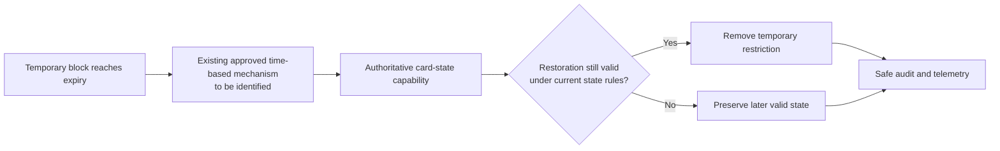
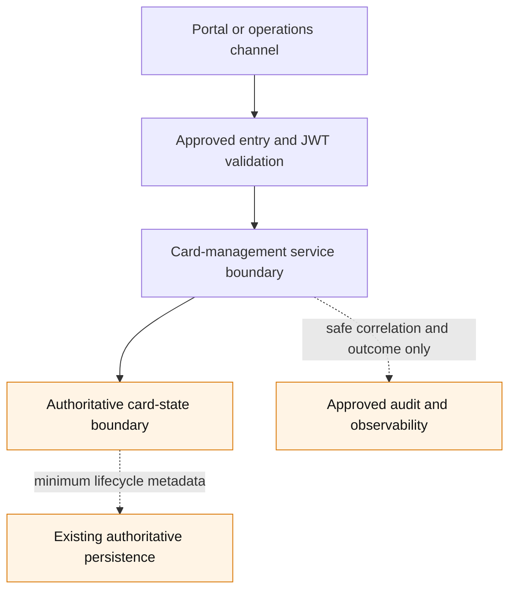

# HLD: Temporary card blocking API

## 1. Impact assessment

| Dimension | Assessment | Evidence or context gap |
|---|---|---|
| Change size | **Medium** | One bounded API and time-based lifecycle extension, with no new platform or service proposed. |
| Complexity / risk | **High** | An incorrect block or restoration changes card usability; the request is confidential and crosses authorization, card-state, audit, and operations concerns. |
| Services or repositories | 2 logical capabilities; repository names unknown | Existing card-management API and authoritative card-state capability are required by the requirement; their implementation boundaries are unconfirmed. |
| Internal integrations | 6 logical integrations | API entry, identity/authorization, client/region resolution, card-state control, audit, and observability. Actual interfaces are unconfirmed. |
| External integrations | None confirmed | No notification, scheme, token-service, or other external dependency is proposed. |
| Data and security impact | High | Confidential card references, card status, requester identity, client/region context, and audit metadata are processed. PCI/CHD classification is unknown. |
| Runtime or deployment impact | Medium | The existing service deployment path and its existing expiry mechanism must support reliable timed restoration. No new environment or infrastructure is proposed. |
| Migration or compatibility impact | Low to medium | A backward-compatible API addition is expected; any state persistence or consumer compatibility effect is unconfirmed. |
| Recommended governance path | Enhanced Solution Architect review and Security input | High operational and security impact plus unresolved state, zone, and expiry evidence require review before LLD. |

**Assessment summary:** This is a medium-sized extension of an existing capability, not a new card-control platform. It is high risk because a failure can incorrectly restrict or restore card use. The smallest compliant design extends the confirmed card-management boundary and reuses the authoritative card-state, authorization, audit, observability, deployment, and existing time-based processing patterns once their estate evidence is supplied.

## 2. Problem and intended outcome

Authorized client-facing portal and operations users need to apply a bounded temporary restriction when suspicious activity is detected, then have the restriction removed automatically at expiry. The outcome is an authenticated, authorized, repeat-safe request through the existing card-management API that records safe lifecycle evidence and restores only the pre-existing usable state when no other valid state prevents it.

Success is demonstrated by the requirement acceptance criteria: valid authorized requests create one temporary block with its expiry metadata; invalid, unauthorized, or duplicate requests do not change card state; and expiry produces one auditable, observable restoration decision without exposing sensitive data.

## 3. Scope and boundaries

**In scope**

- A backward-compatible mutation in the existing card-management API boundary.
- Authorization at the established gateway/BFF/service boundaries, including existing client and regional context.
- A temporary-block lifecycle record or equivalent extension in the authoritative card-state model, including requester, timestamps, expiry, and correlation/audit identifiers.
- Automatic expiry through the already approved timing, scheduling, or event-processing capability used by the identified card-state estate.
- Existing audit, telemetry, API documentation, delivery, and rollback patterns.

**Out of scope**

- A new standalone card-control service, authorization model, infrastructure, deployment environment, or notification platform.
- Permanent cancellation, replacement, token lifecycle changes, or a redesign of card state.
- New external events, webhooks, scheme calls, or customer notifications; none is confirmed for this initiative.
- Detailed resource paths, JSON schemas, error payloads, database schema, scheduling implementation, retry algorithm, test cases, runbooks, or migration scripts. These belong in the LLD after approval.

### Affected surfaces

| Surface | HLD position | Confirmation required |
|---|---|---|
| API and channels | Add one backward-compatible mutation to the existing card-management API, reached by the approved client portal and operations channel; exact route, audience, and BFF path are unknown. | Card/API and Identity owners (CG-01, CG-02) |
| Services and repositories | Extend the existing card-management API and authoritative card-state capabilities; service and repository names are not confirmed. | Card/API owner (CG-01) |
| Data and persistence | Store or extend only the minimum temporary-block lifecycle metadata in the authoritative card-state persistence; database, zone, isolation unit, backup, and retention are unknown. | Card data, Security, and Platform owners (CG-05) |
| Events and jobs | Reuse the existing expiry scheduler, durable timer, or event-processing job. No new topic, event, scheduler, or standalone worker is proposed. | Card platform and SRE owners (CG-03) |
| Infrastructure and deployment | Reuse the target estate's existing gateway, service runtime, persistence, observability, and promotion pipeline; cloud, region, platform generation, and shared/dedicated boundaries are unknown. | Platform and deployment owners (CG-05) |
| Integrations | Reuse existing Auth0/API Gateway/IMS authorization, audit, and observability paths where present. No external gateway, scheme, token-service, webhook, or notification integration is assumed. | Identity, Product, and Card owners (CG-02, CG-07) |

## 4. Confirmed context and context gaps

### Confirmed design constraints

| Confirmed constraint | Design implication |
|---|---|
| `REQ-KAN-5` is approved and requires reuse of existing card-management, authorization, audit, observability, and deployment patterns. | Extend the existing ownership boundary; do not create a service or control platform. |
| API standards require HTTPS, authenticated and authorized requests, trusted tenant context, versioned backward-compatible contracts, `X-Request-Id`, and repeat-safe mutations using `X-Idempotency-Key` where safe retries are needed. | The eventual contract must use the enterprise API conventions and publish documentation before implementation. |
| Shared identity direction assigns token issuance to Auth0, edge JWT validation to API Gateway/API Hub, authorization and client/region permissions to IMS, and downstream enforcement to BFF and service boundaries. | Reuse this chain only where it is the target estate's existing path; do not invent roles or bypass service enforcement. |
| Enterprise principles require explicit ownership, security, failure, observability, and rollback. | The authoritative card-state owner and expiry failure semantics are approval prerequisites. |
| Client isolation and CHD/Common Workload guidance require explicit data, network, storage, telemetry, and access boundaries. | Zone and tenant evidence must be resolved before LLD; portal responses and telemetry must not expose CHD by default. |
| Secure-logging guidance prohibits PAN, SAD, secrets, tokens, authorization headers, and full sensitive payloads in logs or telemetry. | Use only safe identifiers, correlation IDs, outcome codes, and masked/tokenized values where operationally necessary. |
| Shared observability requires structured logs, metrics, traces, health signals, owned dashboards, alerts, SLOs, and runbooks. | Instrument both request and expiry paths through the approved platform; vendor, thresholds, retention, and runbook remain to be confirmed. |
| The design baseline is the authoritative version reference. | This HLD preserves the exact reference: [`../evidence/design-baseline.yaml`](../evidence/design-baseline.yaml). |

### CONTEXT GAPs

| ID | Missing fact | Owner | Retrieval action and decision impact |
|---|---|---|---|
| CG-01 | The card-state owner, card-management API owner, repositories, deployed service boundary, current API route/version, and authoritative state machine are unknown. | Card service / API owner | Add service-catalog, repository, API, and state-machine evidence to `context/relative/`; confirm the extension point and prior-usable-state semantics. |
| CG-02 | The approved duration bounds, eligible requester types, permissions, client/region resolution, and behavior for an already temporarily blocked card are unknown. | Product, Risk, Card, and Identity owners | Provide policy and entitlement evidence; define the domain rules and standard error mapping before contract design. |
| CG-03 | The existing expiry capability, its owner, its reliability characteristics, and its retry/reconciliation approach are unknown. | Card platform and SRE owners | Identify the existing scheduler, durable timer, or event consumer and its runbook; confirm one-time expiry processing and recovery behavior. |
| CG-04 | The card's behavior when another state transition occurs during the temporary block, including whether restoration is permitted, is unknown. | Card platform owner | Supply authoritative state-transition and conflict-precedence rules; this is a blocking domain decision for automatic restoration. |
| CG-05 | PCI/CHD/Common Workload classification, client isolation unit, data store, backup, retention, access model, cloud/region, and deployment generation are unknown. | Card data, Security, and Platform owners | Supply current data-flow, environment, deployment, and retention evidence; obtain Security review if zone or classification remains unknown. |
| CG-06 | Audit event contract, telemetry fields/redaction, dashboard, alert, SLO, retention, and support ownership are unknown. | Operations/SRE, Security, and API owners | Confirm the existing standards and service-specific operational assets; add approved references before LLD. |
| CG-07 | Whether notifications, external gateway exposure, card-network, token-service, webhook, or event-stream integration is required is unknown. | Product and Card owners | Confirm the integration inventory. No such integration is included in this proposal unless formally added. |

## 5. Reuse and platform fit

| Capability considered | Reuse / decision | Owner and evidence needed |
|---|---|---|
| Card lifecycle and state | **Extend existing capability** | Card platform owner must identify the authoritative service and state transition contract (CG-01, CG-04). |
| API exposure | **Reuse existing API Gateway/API Hub and card-management API** | API owner must identify the route, version, audience, and portal/BFF path (CG-01, CG-02). |
| Identity and authorization | **Reuse Auth0, API Gateway/API Hub, IMS, and existing policy enforcement where deployed** | Identity owner must confirm permission, region, and client-resolution evidence (CG-02). |
| Timed processing | **Reuse an existing approved mechanism; do not build a timer platform** | Card platform and SRE must select the existing estate mechanism (CG-03). |
| Persistence | **Extend the authoritative card-state persistence only if required** | Card data owner must confirm record ownership, isolation, retention, and compatibility impact (CG-05). |
| Audit and observability | **Reuse existing enterprise platforms and service instrumentation** | Operations and Security must confirm the approved fields, retention, access, and operational assets (CG-06). |
| Events, webhooks, and notifications | **No new use proposed** | Product and Card owners must confirm whether an existing integration is required (CG-07). |

The initiative has no selected context-pack items and no initiative-relative files. Shared documents are imported snapshots, so their upstream sources must be verified before material API, security, or platform decisions. No repository or runtime search evidence is available; "not identified" is not evidence that a component does not exist.

## 6. Target approach

The proposed logical flow is:

1. The existing portal or operations client invokes the existing card-management API through the approved entry path.
2. The gateway authenticates the request; the applicable BFF and the card-management service enforce the established authorization, client, and regional policy.
3. The authoritative card-state capability validates the requested duration, idempotency, card eligibility, and absence of an active temporary block using the confirmed domain rules.
4. In one authoritative state operation, it applies the temporary restriction and retains the minimum metadata needed to identify the requester, correlation, creation time, expiry, and restoration condition. It emits the existing audit and telemetry signals.
5. The existing approved time-based mechanism locates due temporary blocks and requests restoration through the same authoritative state boundary. Restoration is conditional: it must not override a later valid non-usable state.
6. The existing API contract communicates the result using standard safe success and error conventions. Exact response shape remains an LLD concern.

No new direct portal-to-domain-service connection, state-owning database, event topic, webhook, notification service, or deployment component is proposed.

```mermaid
sequenceDiagram
    participant Actor as Authorized portal or operations actor
    participant Gateway as Existing API Gateway/API Hub
    participant Authz as Existing authorization path
    participant CardAPI as Existing card-management API
    participant State as Authoritative card-state capability
    participant Audit as Existing audit and telemetry platforms

    Actor->>Gateway: Temporary-block request
    Gateway->>Gateway: Authenticate and validate request context
    Gateway->>Authz: Resolve existing permission and client/region context
    Authz-->>Gateway: Allow or deny
    Gateway->>CardAPI: Authorized request with correlation context
    CardAPI->>State: Validate and apply temporary block
    State-->>Audit: Safe audit and observability signals
    State-->>CardAPI: Outcome
    CardAPI-->>Actor: Standard success or safe error
```



## 7. Options and trade-offs

| Option | Benefits | Material trade-offs / constraints | Decision |
|---|---|---|---|
| **A. Extend the existing card-management and authoritative card-state capability; use its approved expiry mechanism.** | Preserves one state owner; minimizes new interfaces and operational surface; aligns with the requirement and reuse guardrails. | Requires evidence that the existing state model and timing mechanism can represent the temporary restriction and safe conditional restoration. | **Recommended, subject to CG-01 through CG-06.** |
| **B. Extend the existing card-state capability but use an approved enterprise event/scheduling mechanism if the current estate has no supported expiry path.** | Can provide durable recovery and independent processing at scale without a local platform. | Adds an asynchronous contract, ownership, ordering, retry, retention, access-control, and operational obligations. It is not justified until CG-03 confirms a gap. | Conditional fallback only; Architecture and platform owners must approve. |
| **C. Create a standalone temporary card-control service.** | Isolates feature logic. | Duplicates card-state ownership and authorization, adds deployment and reconciliation risk, and violates the explicit reuse/no-new-service constraint. | Rejected. |

**Recommendation:** Select Option A. Add the new API operation and a time-bounded state extension at the existing authoritative card-management/card-state boundary, using the estate's existing approved time-based processing capability. Escalate to Option B only if owners demonstrate that no supported existing expiry pattern can meet the required reliability and recovery behavior.

## 8. Security, NFRs, and operations

### Security and privacy

- Use HTTPS and the existing authentication path. Use established scopes, roles, or claims and enforce authorization at every existing policy boundary; do not define new roles in this HLD.
- Propagate and validate the established client and regional context. The state capability must not disclose card existence or state to unauthorized actors.
- Classify the API, persistence, job/event path, backups, caches, audit data, and telemetry as CHD, Common Workload, or other current platform zones before LLD. Do not assume zone placement from the absence of PAN.
- Use card tokens or safe identifiers where the current card-management API permits. Do not place PAN, SAD, secrets, headers, raw payloads, or reversible identifiers in application logs, traces, events, dashboards, tickets, or AI context.
- Retention, encryption, access control, key/certificate requirements, and any cross-zone flow must reuse approved policies and require confirmation from the responsible owners.



The diagram is logical only. The exact zone, region, network path, data store, and telemetry export boundary are unknown (CG-05 and CG-06).

### Reliability, performance, and operations

- Make the mutation repeat-safe using the established idempotency convention. Define duplicate, concurrent, timeout, and retry outcomes in the LLD against the authoritative state model.
- Treat creation and expiry as business-critical outcomes. Monitor request volume, authorization denials, validation failures, duplicate attempts, blocks created, expiry due/completed/failed, restoration prevented by later state, processing lag, dependency failures, and latency using safe tags.
- Propagate the approved request/correlation identifier across synchronous and expiry paths. Use structured logs, approved metrics, and OpenTelemetry-compatible tracing where those are the target service conventions.
- Establish an owner for dashboards, alerts, SLOs, retention, access, and an operational runbook before release. Thresholds, SLO values, on-call routing, and retention are unconfirmed and are not specified here.
- Reconciliation for missed or failed expiry processing must use the existing card-state and operational pattern. The exact detection interval and recovery procedure remain CG-03/CG-06 decisions.

## 9. Delivery, rollout, and rollback

1. **Preconditions:** resolve CG-01 through CG-06; confirm the current API and state contract, security/zone classification, expiry support, and production operational ownership. Obtain Solution Architect approval and required Security input before LLD.
2. **Contract and compatibility:** introduce the operation as a backward-compatible addition to the existing API surface. Publish the approved contract and client guidance through the existing documentation process. Do not select a route, version, or schema in this HLD.
3. **Controlled rollout:** use the existing service delivery pipeline and environment progression. Enable the capability only through the estate's approved configuration, entitlement, or release-control mechanism once confirmed; no new feature-flag platform is proposed.
4. **Release verification:** confirm authorized creation, denied/invalid/duplicate behavior, expiry restoration, preservation of a later non-usable state, auditability, telemetry, and expiry recovery using non-sensitive test data and the approved environments.
5. **Rollback:** disable new request admission through the existing release-control mechanism and revert the compatible service change if health or correctness signals fail. Do not bulk-remove active blocks without Card, Risk, and Operations authorization; active-block recovery must follow the confirmed authoritative state and incident process.

No data migration is assumed. If the existing authoritative state persistence requires a compatible schema or record evolution, the LLD must define its migration, backfill, rollback, and coexistence approach after CG-05 is resolved.

## 10. Risks and decision points

| Risk | Impact | Mitigation / decision required | Owner |
|---|---|---|---|
| Incorrect restoration overrides a later restriction or state change. | Card could become usable when it should not be. | Confirm state precedence and make restoration conditional through the authoritative state boundary. | Card platform owner |
| Expiry processing is delayed, duplicated, or unavailable. | Cards remain blocked too long or restoration processing is inconsistent. | Reuse a proven mechanism; define idempotency, recovery, reconciliation, alerts, and operational ownership. | Card platform and SRE owners |
| Authorization or region/tenant propagation is incomplete. | Unauthorized cross-client or cross-region card control. | Confirm permissions and policy boundaries; perform Security review and end-to-end authorization validation. | Identity, Card, and Security owners |
| Telemetry or audit includes sensitive data. | Compliance and security exposure. | Apply data minimization, redaction, safe identifiers, access controls, and Security review. | Security and SRE owners |
| API differs across legacy and strategic estates. | Compatibility or inconsistent user behavior. | Identify target generation, affected clients, and coexistence requirements before implementation. | Card platform and Architecture owners |
| Business policy is incomplete. | Incorrect duration, actor, notification, or duplicate-request behavior. | Resolve CG-02 and CG-07 before contract approval. | Product, Risk, and Card owners |

**Architecture decision points**

- Confirm Option A is feasible with the identified authoritative state and existing expiry capability.
- Confirm state-transition precedence and the automatic-restoration rule.
- Confirm authorization, client/region isolation, zone classification, and operational acceptance evidence.
- Determine whether the high-risk change requires ARB review in addition to the required Solution Architect approval.

## 11. Traceability

| Item | Link / status |
|---|---|
| Source work item | [Jira KAN-5](https://randomtry.atlassian.net/browse/KAN-5) |
| Approved requirement | [`../requirement.md`](../requirement.md), `REQ-KAN-5-01` through `REQ-KAN-5-08` |
| Context manifest | [`../context-manifest.yaml`](../context-manifest.yaml); draft with no selected items |
| Relative context | None present at generation time |
| Exact design baseline | [`../evidence/design-baseline.yaml`](../evidence/design-baseline.yaml) |
| Impact assessment evidence | [`../evidence/hld-assessment.yaml`](../evidence/hld-assessment.yaml) |
| Affected repositories and services | Unresolved; CG-01 |
| Follow-on LLD | Locked until human architecture approval |

## Architecture approval

Solution Architect / ARB: pending. This HLD is a draft proposal and does not approve architecture, implementation, release, or deployment.
