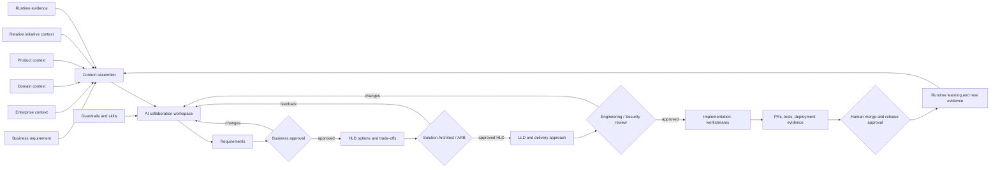

# Review of the AI Collaboration SDLC Concept

## Overall assessment

The diagrams describe a strong foundation for the proposed AI-native SDLC. The important idea is not simply “AI generates a design.” It is the separation of:

1. **AI Consistent Context** — the stable business, domain, product, regulatory, and enterprise context that should be reused across initiatives;
2. **AI Guardrails** — the technology, architecture, security, risk, and delivery constraints that control what AI may propose or do;
3. **AI Relative Context** — the feature-specific context assembled for one initiative;
4. **AI Output** — problem-space analysis, solution concepts, HLD, and delivery approach;
5. **Human Milestones** — explicit points where Product, Solution Architecture, Engineering, Security, or an Architecture Review Board own the decision.

This is the right conceptual model. It is closer to a governed engineering collaboration system than to an AI coding assistant.

The main change needed is to turn the visual concept into a **typed, versioned, stateful workflow**. Every context set, skill, artifact, review, and approval needs an identity, owner, version, hash, status, and traceability link.

## What I see in the diagrams

### Diagram 1: collaboration and design flow

The first diagram appears to show:

- a financial-services context, including global industry, regional, and issuer/processor context;
- business analysis and product/design thinking;
- domain context and technology radar;
- AI agents collaborating around analysis and design;
- design output moving toward HLD and delivery planning;
- review and collaboration points;
- human checkpoints before the design proceeds;
- downstream implementation and delivery.

The emphasis on ISO 8583, payment processing, AWS, domain boundaries, and existing repositories is important. It makes the context domain-specific and enterprise-aware rather than generic.

### Diagram 2: context and skill model

The second diagram is especially useful because it separates **why**, **how**, **what**, and **output**:

```text
AI Consistent Context
  Business: why
  Product: why

AI Guardrails
  Technology: how
  Architecture principles
  API-first rules
  Tech radar

AI Relative Context
  Standards such as ISO 8583
  Current GitHub repositories
  Feature-specific facts

AI Output
  Solution concept
  High-Level Design
  Delivery approach

Human Milestone
  Human review
  HLD approval
  Delivery approval
  Architecture Review Board where required
```

That separation should become the central model for the platform.

## Recommended refinement: five context classes

The current diagrams show four useful groups, but implementation will be clearer if context is divided into five classes:

| Context class | Meaning | Examples | Change frequency |
|---|---|---|---|
| Enterprise context | What the organization believes and requires everywhere | Architecture principles, security baseline, risk appetite, approved technology, operating model | Slow |
| Domain context | The shared language and rules of a business domain | Payments, issuing, acquiring, ISO 8583, settlement, disputes, glossary, domain model | Medium |
| Product context | Why a product exists and what outcomes matter | Product strategy, customer journeys, product constraints, KPIs, roadmap | Medium |
| Relative/initiative context | What is relevant to the current change | Jira/GitHub issue, impacted services, current APIs, ADRs, incidents, dependencies | Fast |
| Runtime/evidence context | What is actually happening in the deployed estate | SLOs, metrics, incidents, topology, deployment state, cost, performance | Very fast |

The first three should be curated and governed. The fourth should be assembled automatically. The fifth should be read from operational systems and used for validation, impact analysis, and release decisions.

## The target AI-SDLC model



The loop is continuous, but the approvals are not optional. AI can go backward and regenerate work; it cannot move forward across a gate by itself.

## Where skills fit

The diagrams refer to contexts and skills. They should remain separate:

### Contexts are facts and constraints

Examples:

- “The organization operates as a global issuer processor.”
- “ISO 8583 is used for this transaction flow.”
- “This service owns authorization but not settlement.”
- “Customer data is confidential.”
- “Public APIs require backward compatibility.”

### Skills are repeatable ways of working

Examples:

- discover impacted repositories;
- perform payment-domain analysis;
- generate HLD options;
- conduct threat modeling;
- review API compatibility;
- produce a migration plan;
- review a design against architecture principles.

A skill should define:

```yaml
skill:
  id: "payments.hld-generation"
  purpose: "Generate payment-domain HLD options"
  inputs:
    - approved_requirements
    - domain_context
    - relative_context
    - architecture_guardrails
  tools:
    - read_repository
    - search_design_repository
    - render_diagram
  output_schema: "hld.v0.1"
  prohibited_actions:
    - approve_architecture
    - merge_code
  reviewer: "solution-architect"
```

A model or coding agent can execute the skill, but the skill contract remains stable when the model changes.

## Context management model

### Context should not be one giant prompt

The AI should receive a **context pack** assembled for the current step. The pack should include only the context appropriate to the role and stage.

For example:

| Stage | Context pack |
|---|---|
| Requirements | Product why, business glossary, domain rules, issue, acceptance examples, constraints |
| HLD | Approved requirements, enterprise guardrails, domain context, current architecture, impacted services, APIs, ADRs, incidents, runtime evidence |
| LLD | Approved HLD, selected option, impacted repository slices, API/database standards, implementation conventions |
| Implementation | Approved HLD/LLD slice, task scope, base commit, allowed paths, tests, contracts |
| Architecture review | HLD diff, options, evidence, risks, standards violations, open questions, downstream impact |
| Release review | merged commits, test/security evidence, deployment plan, rollback, SLOs, runtime health |

### The context manifest is the contract

Every generated artifact should carry:

```yaml
context:
  pack_id: "CTX-PAY-1234-HLD"
  pack_version: 4
  generated_at: "2026-07-21T00:00:00Z"
  items:
    - uri: "github://payments-api@abc123"
      source_type: "repository"
      source_version: "abc123"
      authority: "service-owner"
      classification: "internal"
      freshness: "current-commit"
      why_included: "current authorization flow"
      content_sha256: "sha256:..."
```

This gives architects the ability to ask: “Which version of the repository and which standard did the AI use?”

### Retrieval order

The context assembler should retrieve in this order:

1. Explicit references from the requirement.
2. Enterprise and domain guardrails applicable to the risk and technology.
3. Product and business context.
4. Ownership and dependency graph.
5. Current source, API, database, and infrastructure artifacts.
6. Relevant ADRs, previous designs, incidents, and runtime evidence.
7. Similar examples using semantic retrieval.

Start with deterministic filtering and graph traversal. Add vector search later for glossary, previous designs, and examples. A vector result must never be accepted without its authoritative source and version.

## Human milestones in the diagrams

The red “Human Milestone” around HLD and delivery approach is exactly the right instinct. I recommend making the milestones explicit:

| Milestone | Human decision | AI can prepare | Downstream effect |
|---|---|---|---|
| M1 — Business intent | Is this the right problem and scope? | Requirement draft, questions, acceptance criteria | Unlocks design exploration |
| M2 — Requirements | Are the requirements complete and testable? | Requirement quality report, contradiction analysis | Unlocks HLD generation |
| M3 — Architecture | Which solution should the organization own? | Options, scorecard, diagrams, risks, ADRs | Unlocks LLD and implementation planning |
| M4 — Detailed design | Is the design implementable and safe? | API/schema/test/migration/observability details | Unlocks repository workstreams |
| M5 — Engineering | Does the implementation match the design and standards? | PR summary, tests, security and conformance checks | Unlocks merge |
| M6 — Release | Is the change safe to deploy now? | Release evidence, canary/rollback, health assessment | Unlocks deployment |
| M7 — Learning | What changed in the real system? | Runtime analysis, drift detection, ADR proposal | Updates context and future designs |

Approval should apply to an immutable artifact version/hash. A later edit must create a new version and invalidate downstream artifacts as necessary.

## How Confluence fits the concept

The “Solution Design Confluence Template” is useful as the collaboration and presentation layer. It should contain:

- problem space;
- business and domain context;
- solution concept;
- HLD;
- delivery approach;
- review questions;
- approval status;
- links to repositories and Jira.

However, Confluence should not be the only source of truth for the HLD gate. The durable approval should be stored in a version-controlled design artifact or approval service. Confluence can show the artifact and collect collaboration feedback; the approved content must still have an immutable version/hash.

Recommended hybrid:

```text
Git / Design Repository
  authoritative artifacts, hashes, approvals, ADRs
        ↓ publish
Confluence
  human collaboration, navigation, summaries, comments
        ↓ feedback link
Git design PR / change request
```

This preserves the usability of Confluence without allowing a mutable page to unlock implementation accidentally.

## How the first implementation should reflect the diagrams

### Phase 1 — Make the context model real

Create the following GitHub directories:

```text
context/
  enterprise/
  domain/payments/
  product/
  guardrails/
  skills/
initiatives/
  PAY-1234/
    context-manifest.yaml
    requirement.md
    hld.md
    approvals.yaml
```

Start with manually curated content for enterprise, domain, product, and guardrail context. Automate only the relative context initially: repository metadata, APIs, ADRs, dependencies, and issue details.

### Phase 2 — Make the human milestone executable

Use a GitHub HLD PR with:

- Solution Architect CODEOWNER;
- required review;
- required `das-validate` check;
- required `architecture-gate` check;
- approval recorded against the HLD commit hash;
- downstream workflows blocked until the check passes.

### Phase 3 — Add AI collaboration

Add agent actions to:

- draft requirements;
- generate two or more HLD options;
- answer review comments;
- regenerate only affected sections;
- produce LLD after approval;
- create delivery workstreams after LLD approval.

### Phase 4 — Add Confluence and Jira

Once the GitHub-only lifecycle works:

- add Jira as the work-item adapter;
- publish approved artifacts to Confluence;
- ingest Confluence pages as versioned proposed context;
- preserve the same DAS IDs, artifact hashes, and approval events.

## Important changes I recommend to the original concept

### 1. Add Product Context explicitly

The diagram shows “Product — The Why” but it appears underdeveloped. Add product strategy, customer journeys, KPIs, roadmap constraints, and product decision records. Business context explains the industry; product context explains why this feature exists now.

### 2. Separate guardrails from context

“API-first,” “everything in architecture principles,” security rules, and tech radar are not just context. They are enforceable guardrails. Store them separately and evaluate them as policy.

### 3. Add runtime evidence

The current model is strong for design-time context. Add production topology, SLOs, incidents, performance, cost, and deployment state so the AI does not design from stale documentation alone.

### 4. Add artifact identity and state

Every output needs:

```text
artifact ID
version
status
owner
content hash
parent artifacts
context pack hash
approvals
```

### 5. Add explicit invalidation

If an approved HLD changes, the system must know whether the LLD, plan, stories, or PRs are now stale. Without invalidation, the workflow can look governed while implementing an obsolete design.

### 6. Keep the agent collaboration bounded

The agents should collaborate through artifacts and structured handoffs, not unrestricted conversation. Each agent receives a role, skill, context pack, tools, output schema, and stop conditions.

## Final recommendation

Your diagrams should become the **conceptual reference model** for the enterprise AI-SDLC:

```text
Consistent Context + Guardrails + Relative Context
              ↓
        AI Collaboration
              ↓
      Versioned Design Outputs
              ↓
        Human Milestones
              ↓
      Controlled Engineering Work
              ↓
        Runtime Evidence Loop
```

The next concrete step is not to build every agent. It is to build one GitHub-based vertical slice using a payments-domain example:

1. manually curate enterprise/domain/product/guardrail context;
2. automatically assemble repository and feature-relative context;
3. generate a requirement and two HLD options;
4. review the HLD through a human Solution Architect milestone;
5. block implementation until approval;
6. generate LLD and one real implementation PR;
7. feed deployment evidence back into the context model.

That will validate the most important idea in the diagrams: **AI can participate in the entire lifecycle, while humans remain the owners of intent, architecture, risk, and release decisions.**
